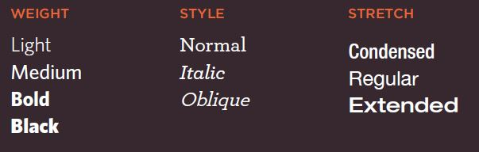

# ***Read: 05 - HTML Images; CSS Color & Text***
- - - 
#### From the Duckett HTML book
- - -
## Chapter 5: Images

when using images we should create a folder for all of the images the site uses.  

*** we add them by an  element, this must carry two attributes:src and alt , it can have two other attributes that specify its size: height and width ***   

examples of ***image placement***:   

* before a paragraph: The paragraph starts on a new line after the image.   
* inside the start of a paragraph: the first row of text aligns with the bottom of the image.   
* in the middle of a paragraph: The image is placed between the words of the paragraph that it appears in.   

we can ***aligni images*** horizontally ond vertically   
 
we should conseder this:   
* Save images in the right format
* Save images at the right size
* Use the correct resolution

When cropping images it is important not to lose valuable information. It is best to source
images that are the correct shape if possible.

Images created for the web should be saved at a ***resolution of 72 ppi*** . The higher the resolution of the image, the larger the size of the file.    
***Vector images*** differ from bitmap images and are resolution-independent. Vector images are commonly created in programs such as Adobe Illustrator.    
***Animated GIFs*** show several frames of an image in sequence and therefore can be used to create simple animations.   

***&lt;figure> element*** to contain images and their caption so that the two are associated. You can have more than one image inside it long as they all share the same caption.   
***&lt;figcaption> element*** allow web page authors to add a caption to an image.  
- - -
## Chapter 11: Color
 
we can specify any colour in CSS in one of three ways: RBG value, hex codes ,colour names.   

It is important to ensure that there is enough contrast between any text and the background colour (otherwise people will not be able to read the content).   

***opacity*** rgba ( we add a number at the end for the opacity value 0.5 for example).   
 CSS3 also allows you to specify colours as HSL values, with an optional opacity value HSLA.  

- - -
## Chapter 12: Text

### The properties of text appearance  can be split into two groups:  
 
* directly affect the font and its appearance (including the typeface, whether it is regular, bold or italic,and the size of the text)   
* would have the same effect on text no matterwhat font you were using (including the color of text andthe spacing between words and letters)   

### Typeface Terminology

* ***Serif fonts*** have extra details on the ends of the main strokes of the letters. These details are known as serifs  
* ***Sans-serif*** have straight ends to letters, and therefore have a much cleaner design.   
* ***Every letter*** in a monospace (or fixed-width) font is the same width. (Non-monospace fonts have different widths.)

other caricters :   
   

The ***font-family*** property  allows you to specify thetypeface that should be used for any text inside the elements towhich a CSS rule applies.    

You can control the space between lines of text,individual letters, and words. Text can also be alignedto the left, right, center, or justified. It can also be indented.   

- - - 
#### From the Blog Post
- - -

## JPEG vs PNG vs GIF   
* JPEG format for all images that contain a natural scene or photograph where variation in colour and intensity is smooth   
* PNG format for any image that needs transparency or for images with text & objects with sharp contrast edges like logos
* GIF format for images that contain animations.   
