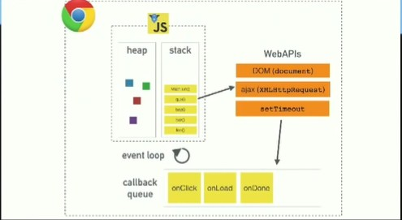

# Read: Class 0 : Pre-Work - Code 401: Advanced Javascript Development

---

## Article : Solving Problems

---

first thing in solving problems is that we need make sure you take enough time to understand the problem completely before attempting to solve it.

the steps has to be some thing like this

> - **Read the problem completely twice.**  
>   If you don’t understand the problem, you cannot solve it  
>   make sure you completely understand the problem. A good test of this is whether or not you can explain the problem to someone else.

> - **Solve the problem manually with 3 sets of sample data.**
> - **Optimize the manual steps.**
> - **Write the manual steps as comments or pseudo-code.**

put all the steps into the editor as comments or write them as psuedo-code that we can translate to real code. By doing this, we can know exactly what the structure of the code we are going to write is going to look like which makes the job of filling in the actual code later trivial.

> - **Replace the comments or pseudo-code with real code.**
> - **Optimize the real code.**  
>   As much as 70% of our time should be spent in steps 1-3.

---

## Article : Act like you make $1000/hr

---

> “Living in frenzy is a sign we’ve squandered too much.” -Niklas Goke

How do you value your time?
Take stock of the things you did this week.  
How many of them were worthy of $1,000/hour?  
How many activities were a true waste of time?  
Value your time at what it deserves to be. The higher the value, the more important and productive work you’ll do — and the less trivial and mindless tasks you’ll get caught in.  
when you value your time you're 100x More Productive

---

## Article : How to think like a programmer

---

> Problem-solving skills are almost unanimously the most important qualification that employers look for….more than programming languages proficiency, debugging, and system design.

> “Everyone in this country should learn to program a computer, because it teaches you to think.” — Steve Jobs

to think like a programmerm is all about a more effective way for problem solving.  
Problem solving is the meta-skill( a high order skill that allows you to engage with functional expertise more effectively)  
The best way involves a) **having a framework** and b) **practicing it**

#### Have a framework

So, what should you do when you encounter a new problem?
Here are the steps:

1. Understand

Most hard problems are hard because you don’t understand them

“If you can’t explain something in simple terms, you don’t understand it.” — Richard Feynman

How to know when you understand a problem? When you can explain it in plain English.

you should write down your problem, doodle a diagram, or tell someone else about it

2. Plan

Don’t dive right into solving without a plan

To get a good plan, answer this question:“Given input X, what are the steps necessary to return output Y?”

3. Divide

Do not try to solve one big problem , break it into sub-problems.  
solve each sub-problem one by one.  
Begin with the simplest. simplest means this sub-problem being solved doesn’t depend on others being solved.  
Once you solved every sub-problem, connect the dots. that will give you the solution to the original problem

4. Stuck?

be more curious about bugs/errors than irritated.  
there are three things to try

- Debug: Go step by step through your solution trying to find where you went wrong. Programmers call this debugging (in fact, this is all a debugger does).

- Reassess: Take a step back. Look at the problem from another perspective. Is there anything that can be abstracted to a more general approach?  
  Another way of reassessing is starting anew. Delete everything and begin again with fresh eyes. I’m serious. You’ll be dumbfounded at how effective this is.

- Research: Ahh, good ol’ Google. You read that right. No matter what problem you have, someone has probably solved it. Find that person/ solution. In fact, do this even if you solved the problem! (You can learn a lot from other people’s solutions).

#### Practice

Practice. Practice. Practice.

In fact, a common pattern amongst successful people is their habit of practicing “micro problem-solving.” For example, Peter Thiel plays chess, and Elon Musk plays video-games.  
So, what you should do is find an outlet to practice. Something that allows you to solve many micro-problems (ideally, something you enjoy).

> Each time, you’ll learn something.

> Each time, you’ll develop strength, wisdom, and perspective.

> Each time, a little more of the competition falls away. Until all that is left is you: the best version of you.” — Ryan Holiday (The Obstacle is the Way)

---

## Article : The 5 Whys , Getting to the Root of a Problem Quickly

---

How to Use the 5 Whys :

1. Assemble a Team
2. Define the Problem
   Discuss itand write a brief, clear problem statement that you all agree on.

3. Ask the First "Why?"

answering it requires serious thought. Search for answers that are grounded in fact: they must be accounts of things that have actually happened, not guesses at what might have happened.

4. Ask "Why?" Four More Times

For each of the answers that you generated in Step 3, ask four further "whys" in succession. Each time, frame the question in response to the answer you've just recorded.

5. Know When to Stop
   You'll know that you've revealed the root cause of the problem when asking "why" produces no more useful responses, and you can go no further

6. Address the Root Cause(s)
   discuss and agree on the counter-measures that will prevent the problem from recurring.

---

## Video : What the heck is the event loop anyway

---

- the call stack of js is a one thread (one call stack , one thing at a time )
- blocking , what happens when things are slow?

**synchronous** is the nature this would cause the stack (stop and wait tell the line is finished then go to the next line ) to block when things taking time (network request and while loops for example)
thats why there is ways to make it **asynchronous** to stop that block (setTimeout , async await ....) (this push the line to the end of the stack , it will be done when the stack is clear)

---

## Video : The Super Mario Effect | Tricking Your Brain into Learning More

---

the key basically is to not focus on the failures instead focus on the goal to learn more and finish the task  
never giveup and just try again

---
