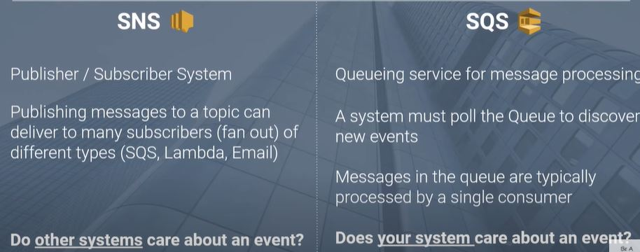

# Read: Class 13 : Readings: Event Driven Architecture

- - -

## Review, Research, and Discussion

* **What’s the difference between a FIFO and a standard queue?**

Standard queues provide at-least-once delivery, which means that each message is delivered at least once. FIFO queues provide exactly-once processing, which means that each message is delivered once and remains available until a consumer processes it and deletes it.

* **How can the server be assured a message was properly received?**

by expictting a particular data 

* **What classic design pattern is best represented by event driven programming?**

subsciber/publisher 

* **How do you test an event driven system?**

an event-driven application architecture is one in which services (aka functions) within an application input data and output data via messages that are stored in a message queue. This differs from a synchronous architecture, in which data is passed straight to a service by making a direct call

- - -

### Document the following Vocabulary Terms

* **FIFO Queue**  In computing and in systems theory, FIFO is a method for organising the manipulation of a data structure where the oldest entry, or "head" of the queue, is processed first.    
  
* **Pub/Sub** Pub/Sub is a flexible, reliable, real-time messaging service for independent applications to publish and subscribe to asynchronous events.    

--- 

## Preview

Which 3 things had you heard about previously and now have better clarity on?
sockit.io , games making 

Which 3 things are you hoping to learn more about in the upcoming lecture/demo?

--
 
What are you most excited about trying to implement or see how it works?

the game 

---

> SQS is mainly used to decouple applications or integrate applications. Messages can be stored in SQS for short duration of time (max 14 days). SNS distributes several copies of message to several subscribers. For example, lets say you want to replicate data generated by an application to several storage systems.

> A social networking service (SNS) is an online vehicle for creating relationships with other people who share an interest, background, or real relationship.

> AWS SNS is a publisher subscriber network, where subscribers can subscribe to topics and will receive messages whenever a publisher publishes to that topic. AWS SQS is a queue service, which stores messages in a queue

    

