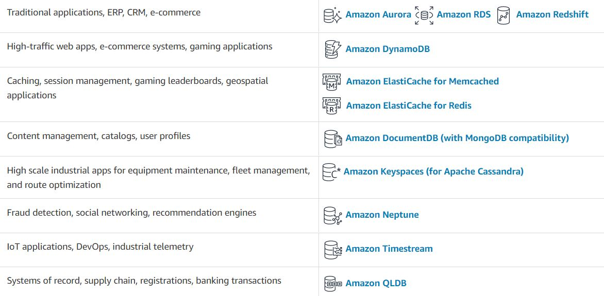

# Read: Class 19 : AWS: Events

---

## Review, Research, and Discussion

- **Describe the similarities between AWS API Gateway + Lambda functions and an ExpressJS Server**

both of them connect a handler (function) to be done when a methoud is used ,

- **List the AWS Database offerings and talk about the pros and cons of each**

- **What’s the difference between a FIFO and a standard queue?**

Standard queues provide at-least-once delivery, which means that each message is delivered at least once. FIFO queues provide exactly-once processing, which means that each message is delivered once and remains available until a consumer processes it and deletes it.

- **How can the server be assured a message was properly received?**

tests and logs

---

### Document the following Vocabulary Terms

- **Serverless API**
  Serverless is a cloud computing execution model where the cloud provider dynamically manages the allocation and provisioning of servers. A serverless application runs in stateless compute containers that are event-triggered, ephemeral (may last for one invocation), and fully managed by the cloud provider.

- **Triggers**
  A trigger generally causes a program routine to be executed. In a database management system (DBMS), a trigger is an SQL procedure that is executed when a record is added or deleted. It is used to maintain referential integrity in the database. A trigger may also execute a stored procedure.

- **Dynamo vs Mongo**

  - MongoDB is vendor agnostic, Open Source, and can be deployed anywhere. DynamoDB is only available on AWS.
  - DynamoDB is a fully managed AWS service, MongoDB can be self installed or fully managed with MongoDB Atlas.
  - DynamoDB as an integrated AWS service makes it easier to develop end to end solutions.
  - DynamoDB uses tables, items and attributes, MongoDB uses JSON-like documents.
  - DynamoDB supports limited data types and smaller item sizes; MongoDB supports more data types and has fewer size restrictions.

- **Dynamoose vs Mongoose**

Dynamoose is a modeling tool for Amazon's DynamoDB. Dynamoose is heavily inspired by Mongoose, which means if you are coming from Mongoose the syntax will be very familar.

---

## Preview

Which 3 things had you heard about previously and now have better clarity on?

--

Which 3 things are you hoping to learn more about in the upcoming lecture/demo?

--

What are you most excited about trying to implement or see how it works?

--

---

SQS and SNS

SQS : Amazon Simple **_Queue_** Service is a distributed message queuing service introduced by Amazon.com in late 2004. It supports programmatic sending of messages via web service applications as a way to communicate over the Internet.

SNS : Amazon Simple **_Notification_** Service is a notification service provided as part of Amazon Web Services since 2010. It provides a low-cost infrastructure for the mass delivery of messages, predominantly to mobile users.

